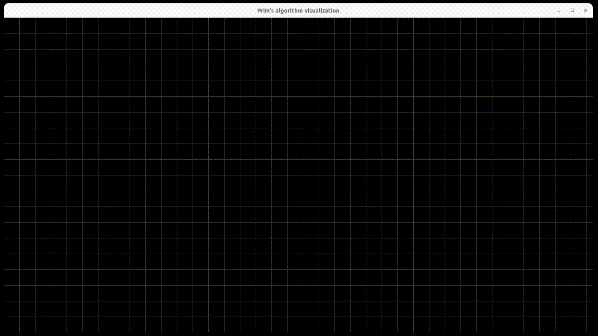

# Prim's Algorithm Visualizer
Prim's Algorithm Visualizer built with C++ and SFML.
This program has a simple keyboard/mouse event driven interface, which allows user to
create any undirectional weighted graph and run algorithm visualization on it.
In the end of the visualization, an graph will be replaces by produced MST.
For more information about algorithm see: [Prim's Algorithm](https://en.wikipedia.org/wiki/Prim%27s_algorithm "Prim's Algorithm")

### Demo

### How to compile
1. You need to have SFML installed. In case you don't have it, follow this guide: [SFML installation](https://www.sfml-dev.org/download/sfml/2.5.1/)
2. Clone this repository
3. Navigate to the root of this repo
4. run `make`. In case of any errors inspect the `Makefile` and configure it for your local environment
5. run executable from `/bin/`

### How to use

interaction with the program is carried out using keyboard and mouse:
- Press `A` to create vertex at mouse current position
- Press `X` to remove vertex/edge at mouse current position
- Press `0-9` numbers to increase weight of an edge which is currently pointed by mouse
- Press `Backspace` decrease weight of an edge which is currently pointed by mouse
- Click and drag `Mouse Right Button` to create edge between 2 vertices
- Click and drag `Mouse Left Button` to move a vertex
- Click and drag `Mouse Middle Button` to move the canvas around
- Press `Space` to start Prim's algorithm animation
